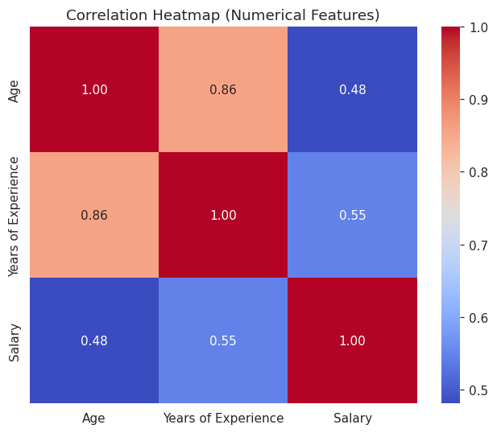
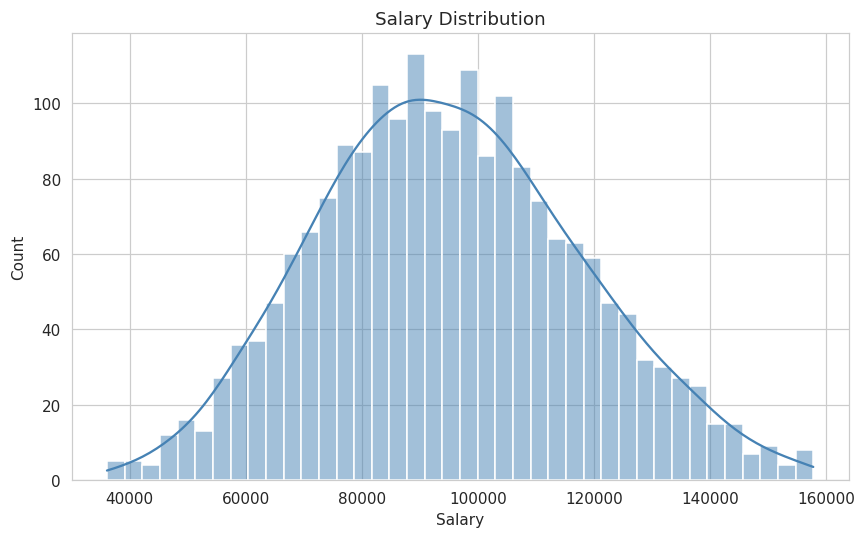
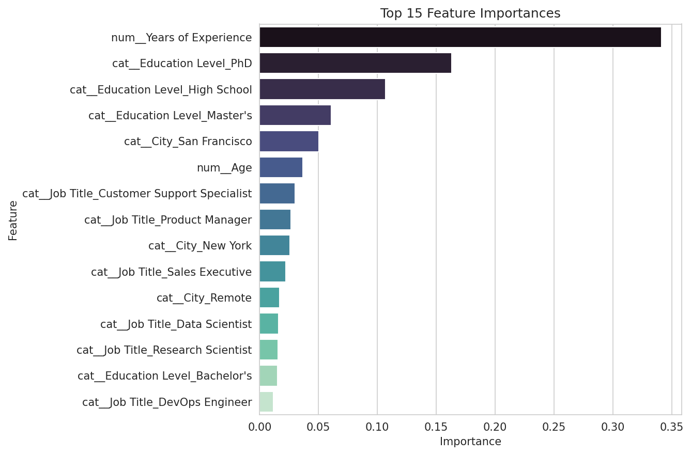

# 💼 Salary Prediction using Ensemble Learning

[](https://github.com/YOUR_USERNAME/Salary_Prediction/actions/workflows/ci.yml)
[](https://www.python.org/downloads/)
[](LICENSE)
[](https://streamlit.io/)
[](https://peps.python.org/pep-0008/)

> Replace `YOUR_USERNAME` above with your actual GitHub username/org once
> you push this repo, so the CI badge links to your own Actions runs.

A complete, end-to-end machine learning project that predicts an employee's
expected annual salary using ensemble regression models. Built as an
AI/ML internship-ready project with clean, modular, PEP 8-compliant Python
code, full EDA, model comparison, hyperparameter tuning, an interactive
Streamlit web application, an automated test suite, and GitHub Actions CI.

---

## 📑 Table of Contents

- [Project Overview](#-project-overview)
- [Objectives](#-objectives)
- [Dataset](#-dataset)
- [Sample Visualizations](#-sample-visualizations)
- [Folder Structure](#️-folder-structure)
- [Installation](#️-installation)
- [Usage](#️-usage)
- [Running Tests](#-running-tests)
- [Continuous Integration](#-continuous-integration)
- [Results](#-results)
- [Technologies Used](#️-technologies-used)
- [Future Scope](#-future-scope)
- [Conclusion](#-conclusion)

## 📌 Project Overview

Salary is influenced by many interacting factors — experience, education,
role, and location, to name a few. This project builds a machine learning
pipeline that learns those relationships from historical data and predicts
the expected salary for a new candidate profile.

Rather than relying on a single algorithm, the project trains **multiple
ensemble regressors**, compares them on standard regression metrics, tunes
the best performer with `RandomizedSearchCV`, and deploys the final model
behind both a command-line script and a Streamlit web app.

## 🎯 Objectives

- Build a clean, reproducible data preprocessing pipeline (missing values,
  duplicates, outliers, encoding, scaling).
- Perform thorough Exploratory Data Analysis (EDA) to understand feature
  relationships and salary drivers.
- Train and fairly compare several ensemble learning algorithms:
  Random Forest, Gradient Boosting, Extra Trees, and (optionally) XGBoost.
- Evaluate models using R², MAE, MSE, and RMSE.
- Tune the best model's hyperparameters.
- Persist the final model with Joblib for reuse without retraining.
- Provide both a CLI prediction script and a Streamlit web app for
  interactive predictions.
- Follow software engineering best practices: modular code, logging,
  exception handling, and PEP 8 style.

## 📊 Dataset

The project ships with `dataset/generate_dataset.py`, which generates a
**synthetic but realistic** salary dataset (`dataset/salary.csv`, 2,000+
rows) modeled after the well-known public "Salary Data" dataset format
(Age, Gender, Education Level, Job Title, Years of Experience, Salary),
plus a bonus `City` column. Salary is generated as a function of
experience, education, job seniority, age, and city cost-of-living, with
random noise added — plus injected missing values and duplicate rows so
the preprocessing code has real issues to clean.

> **Using a real dataset instead:** Download any public salary CSV (e.g.
> from Kaggle) with matching column names and replace
> `dataset/salary.csv`. No other code changes are needed as long as the
> column names match those listed below.

### Feature Descriptions

| Column | Type | Description |
|---|---|---|
| `Age` | Numerical | Age of the individual, in years |
| `Gender` | Categorical | `Male` or `Female` |
| `Education Level` | Categorical | `High School`, `Bachelor's`, `Master's`, `PhD` |
| `Job Title` | Categorical | The individual's job role (e.g. `Data Scientist`, `Software Engineer`) |
| `Years of Experience` | Numerical | Total years of professional work experience |
| `City` | Categorical | City of employment (proxy for cost-of-living / market rate) |
| `Salary` | Numerical (Target) | Annual salary — the value the model predicts |

---

## 🖼️ Sample Visualizations

| Correlation Heatmap | Salary Distribution | Feature Importance |
|---|---|---|
|  |  |  |

More charts (box plots, histograms, pair plot) are generated on demand in
`notebooks/eda_outputs/` when you run `python notebooks/eda.py` — that
folder is git-ignored since it's regenerated locally, not shipped in the repo.

---

## 🗂️ Folder Structure

```
Salary_Prediction/
│
├── .github/
│   └── workflows/
│       └── ci.yml                 # GitHub Actions: lint, test, smoke-run on push/PR
│
├── assets/                        # Screenshots embedded in this README (tracked in git)
│   ├── correlation_heatmap.png
│   ├── salary_distribution.png
│   └── feature_importance.png
│
├── dataset/
│   ├── salary.csv                 # Dataset (generated or user-supplied)
│   └── generate_dataset.py        # Synthetic dataset generator
│
├── models/                        # Git-ignored; regenerated by training
│   ├── salary_model.pkl           # Final trained pipeline (saved by train.py)
│   ├── model_comparison.csv       # Metrics table for all trained models
│   └── feature_importance.png     # Feature importance chart
│
├── notebooks/
│   ├── eda.py                     # Exploratory Data Analysis script
│   └── eda_outputs/               # Git-ignored; regenerated by eda.py
│
├── src/
│   ├── __init__.py
│   ├── utils.py                   # Logging, paths, shared constants
│   ├── preprocess.py              # Cleaning, encoding, scaling, splitting
│   ├── train.py                   # Model training, comparison, tuning, saving
│   ├── evaluate.py                # Metrics + evaluation charts
│   └── predict.py                 # Load model + predict on new input
│
├── tests/
│   ├── __init__.py
│   ├── conftest.py                # Shared pytest fixtures
│   ├── test_preprocess.py         # Preprocessing unit tests
│   ├── test_evaluate.py           # Metrics unit tests
│   └── test_predict.py            # Input validation unit tests
│
├── app.py                         # Streamlit web application
├── main.py                        # Runs the entire pipeline end-to-end
├── requirements.txt               # Runtime dependencies
├── requirements-dev.txt           # Dev/test dependencies (pytest, flake8)
├── .flake8                        # PEP 8 lint configuration
├── .gitignore
├── LICENSE                        # MIT License
└── README.md
```

---

## ⚙️ Installation

**Requirements:** Python 3.11+ (project developed/tested on Python 3.12)

```bash
# 1. Clone the repository
git clone https://github.com/YOUR_USERNAME/Salary_Prediction.git
cd Salary_Prediction

# 2. (Recommended) Create a virtual environment
python -m venv venv
venv\Scripts\activate        # Windows
source venv/bin/activate     # macOS/Linux

# 3. Install runtime dependencies
pip install -r requirements.txt

# 4. (Optional, for running tests/linting locally) Install dev dependencies
pip install -r requirements-dev.txt
```

> **Note on XGBoost:** `xgboost` is listed in `requirements.txt` but is
> treated as optional in the code — if it isn't installed (or fails to
> install on your platform), `train.py` automatically skips it and trains
> the other three ensemble models without error.

---

## ▶️ Usage

### 1. Run the entire pipeline at once

```bash
python main.py
```

This will (in order): generate the dataset if missing → run EDA and save
charts → preprocess data → train and compare all models → tune the best
model → save it to `models/salary_model.pkl` → run a sample prediction to
confirm everything works.

### 2. Run individual steps

```bash
# Generate the dataset only
python dataset/generate_dataset.py

# Run EDA and save charts to notebooks/eda_outputs/
python notebooks/eda.py

# Train, compare, tune, and save the model
python -m src.train

# Re-generate evaluation charts from the saved model
python -m src.evaluate
```

### 3. Predict from the command line

```bash
python -m src.predict
```

You'll be prompted for Age, Gender, Education Level, Years of Experience,
Job Title, and City, and the predicted salary will be printed.

### 4. Launch the Streamlit web app

```bash
streamlit run app.py
```

Then open the local URL Streamlit prints (usually `http://localhost:8501`)
in your browser. Enter candidate details in the sidebar and click
**Predict Salary** to see the result, along with a feature importance
chart and the model comparison table.

---

## 🧪 Running Tests

The project includes a `pytest` suite covering preprocessing (missing
values, duplicates, outlier removal, encoding/scaling), evaluation
metrics, and input validation logic.

```bash
pip install -r requirements-dev.txt

# Run the full test suite
pytest tests/ -v

# Run PEP 8 lint checks
flake8 src app.py main.py dataset/generate_dataset.py notebooks/eda.py
```

## 🔄 Continuous Integration

A GitHub Actions workflow (`.github/workflows/ci.yml`) runs automatically
on every push and pull request to `main`. It:

1. Installs dependencies on Python 3.11 and 3.12
2. Lints the codebase with `flake8` for PEP 8 compliance
3. Generates the dataset and runs the full `pytest` suite
4. Runs `python main.py` end-to-end as a smoke test to catch any
   integration issues the unit tests might miss

Once pushed to GitHub, check the **Actions** tab of your repository to see
these runs, and update the badge at the top of this README with your own
username so it reflects your repo's live status.

---

## 📈 Results

The table below reflects an actual run of `python -m src.train` on the
bundled synthetic dataset (1,589 training rows / 398 test rows, after
cleaning and outlier removal):

| Model | R² Score | MAE | MSE | RMSE | Training Time (s) |
|---|---|---|---|---|---|
| **Gradient Boosting** | **0.8614** | **6,624.92** | 71,699,194.76 | **8,467.54** | 0.28 |
| Extra Trees | 0.8183 | 7,476.48 | 93,988,340.82 | 9,694.76 | 3.46 |
| Random Forest | 0.8141 | 7,662.70 | 96,150,315.57 | 9,805.63 | 2.81 |

**Gradient Boosting** was selected as the best baseline model and tuned
with `RandomizedSearchCV` (5-fold cross-validation, 15 parameter
combinations). After tuning:

| Metric | Value |
|---|---|
| R² Score | **0.8730** |
| MAE | 6,255.27 |
| MSE | 65,709,161.15 |
| RMSE | 8,106.12 |

*(Exact numbers will vary slightly if you regenerate the dataset with a
different random seed, or substitute a real-world dataset — and will
typically improve further once XGBoost is included in the comparison.)*

EDA charts (correlation heatmap, salary distribution, box plots,
histograms, pair plot, feature importance) are saved automatically to
`notebooks/eda_outputs/` when you run `python notebooks/eda.py`.

---

## 🛠️ Technologies Used

- **Python 3.11+**
- **pandas / numpy** — data manipulation
- **matplotlib / seaborn** — visualization
- **scikit-learn** — preprocessing, models, model selection, metrics
- **xgboost** (optional) — gradient-boosted trees
- **joblib** — model persistence
- **streamlit** — interactive web application
- **pytest** — automated unit testing
- **flake8** — PEP 8 style linting
- **GitHub Actions** — continuous integration (lint + test on every push)
- **logging** (standard library) — structured, file + console logging

---

## 🚀 Future Scope

- Integrate a real-world, larger salary dataset (e.g. from government
  labor statistics or Kaggle) for production-grade accuracy.
- Add SHAP-based explainability for individual predictions.
- Add a REST API (FastAPI/Flask) wrapper around the saved model for
  integration with other applications.
- Experiment with stacking/blending ensembles across all trained models.
- Add cross-validated learning curves to diagnose over/underfitting.
- Containerize the app with Docker for consistent deployment.
- Add authentication and a prediction-history database to the Streamlit app.

## ✅ Conclusion

This project demonstrates a full, production-style machine learning
workflow — from raw data to a deployed, interactive prediction app —
using ensemble learning techniques. The modular structure (separate
`preprocess.py`, `train.py`, `evaluate.py`, `predict.py`) makes it easy to
extend, swap in a real dataset, add new models, or plug the trained
pipeline into other applications. It is intended as a strong, practical
portfolio piece for an AI/ML internship application.

---

## 📄 License

This project is provided for educational and portfolio purposes.
